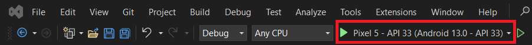
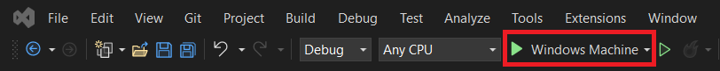

--- 
hide_table_of_contents: true
---

# Alkalmazás buildelése

Az alkalmazás a Visual Studio 2022 eszköztáron a megfelelő opció kiválasztásával építhető.

Ha például Androidra szeretné építeni, válassza az "Android Emulators", vagy ha van, az "Android Local Devices" lehetőséget.

Windows esetén az alapértelmezett "Windows Machine" opciót használhatjuk.

