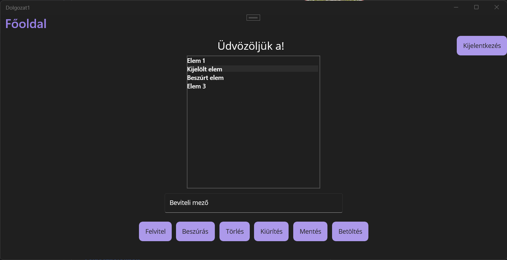

# Főoldal

## Felvítel

A felvítel gommbal a beviteli mezőben lévő szöveget a lista végére szúrja be.

## Beszúrás

A beszúrás gommbal a beviteli mezőben lévő szöveget a jelenleg kijelölt elem elé szúrja be.

## Törlés

:::warning

A törlés nem kér visszaigazolást! Legyen benne biztos hogy a helyes elemet választotta ki!

:::

A törlés gommbal a jelenleg kijelölt elemet távolítja el a listából.

## Kiürítés

A Kiürítés gommbal a lista összes eleme törlésre kerül.

## Mentés

:::warning

Ez a funkció csak érvényes belépés esetén elérhető!

:::

:::danger

A mentés felülírja az előző mentés tartalmát, ez a folyamat nem visszavonható!

:::

A mentés gomb elmenti a lista jelenlegi tartalmát.

## Betöltés

:::warning

Ez a funkció csak érvényes belépés esetén elérhető!

:::

:::danger

A betöltés a listában lévő összes elemet törli, majd betölti az előzőleg elmentett állapotot!

Legyen biztos benne, hogy a betöltés előtt nincs olyan adat, amit el akar menteni!

:::

A betöltés gomb betölti az előzőleg elmentett állapotot